```{r set-options, echo=FALSE, cache=FALSE}
knitr::opts_chunk$set(comment=NA)
options(width = 60)
```

## Today's Agenda

- Welcome to 500!
- Course Overview and the Web Site
- Statistical Philosophy and Problem-Solving
- What are Observational Studies?
    + How do we think about causal effects?
    + Why is randomization so important?
- A Motivating Example: Aspirin and Mortality in Heart Patients
    + How can we avoid being misled?
    + Causal Effects as comparing potential outcomes

## Course Overview

* Randomized Experiments vs. Observational Studies
    + Randomization as the "fundamental basis for inference"
    + Observational Studies and Causal Effects
* Propensity Scores: Crucial Tools for Causal Models
    + Selection Bias: key issue for observational studies
    + Dealing with Bias (both overt and hidden)
    + Subclassification (stratification) and direct regression adjustment
    + Matching and weighting using the Propensity Score
    + Sensitivity Analysis
* Instrumental Variables and Other Techniques
* Using R, RStudio and R Markdown to accomplish all of this

Paul Rosenbaum's 2017 book *Observation & Experiment*

## My Expectations

* You are interested in learning about the effects of an intervention, treatment or policy on subjects when the treatments cannot be assigned at random.
* You have little interest in technical details of methods, but serious interest in designing, conducting and analyzing observational studies skillfully.
* You have access to software (specifically R) which you can use to obtain basic hypothesis testing, regression and logistic regression results.

## Timing of Sessions

- The sessions are scheduled from 8:30 AM to 11:00 AM, but that will be painful over Zoom.
- When possible, I will pre-record a lecture (meant to be about an hour) and make it available to you in advance. 
    - When that happens (as it will next week), we'll instead meet via Zoom from 9:30 to 10:45 AM.
    - For all sessions, Dr. Love is available 10 minutes before and 15 minutes after class for informal "office hours".
- These recordings will be available through our shared Google Drive as soon as possible.
- We'll evaluate how well this is working through the semester.

## The Web Site

\color{blue}{https://thomaselove.github.io/500/}

- Syllabus
    - includes biographies of Wyatt Bensken (TA) and Dr. Love
    - contact us at **500-help** at **case dot edu**
- Calendar
    - links to class sessions, final word on all deadlines
- R and Data
    - Installing/Updating R, RStudio, R Packages
    - Data and Code
    - R-basics example
- Sources / References
    - Some things are **password-protected**.
- Links to Canvas, and to ways to Contact Us
- Assignments ...

## Assignments / Deliverables

1. Course Project
    - Semester-long project, with your first proposal draft due 2021-03-09.
    - Final presentation of your work on 2021-05-06 or 2021-05-13.
2. Observational Studies in Action
    - Present methods/results from a published article using propensity scores.
    - You'll present once as primary reviewer, once as second reviewer.
    - First step is to identify a study and claim it by 2021-03-02.
3. Labs
    - Lab 01 is due **next Thursday** 2021-02-11 before class.
    - In addition to the R-basics materials, there is a "Lab 0" worked example.
    - Last lab - Lab 05 is due 2021-04-01.
4. Essays reacting to Rosenbaum's *Observation & Experiment*
    - Readings detailed in Calendar (Preface, Chapters 1-2 by next week.)
    - First Essay is about Chapter 7, due 2021-03-18.

There are no quizzes or examinations in 500.

## A Key Goal for the Project and Course

* Help you learn how to tackle a problem, rather than just be able to perform particular statistical techniques.
    + Goal: think and solve problems when trying to infer causal effects from observational data
* But the need to think in statistical terms is omnipresent
    + Identifying researchable problems
    + Dealing with variation
    + Interplay of Design and Analysis
    + Preparing, writing and revising results, in a replicable way.

## Comparative Effectiveness Studies

- We have an outcome measured on two groups of subjects 
    - Let's refer to them as the treated group and the control group.
- We want to make a fair comparison between the treated group and the control group in terms of the outcome.
    - We want to ensure that the groups are comparable in terms of **covariates** (that describe the subjects before the treatments are applied.)
    - If they aren't comparable, it will be difficult for us to make a fair comparison.

## Stages of a Statistical Investigation

Statistical thinking is required in all stages of the investigation:

1. Planning the Study
2. Collecting the Data
3. Analyzing the Results
4. Interpreting the Analyses
5. Presenting the Study

We'll spend some time in all five stages.

## Early Stages of an (Idealized) Investigation

* Understand the problem, then formulate it in statistical terms.
    + Clarify the objectives very carefully.  Ask as many questions as necessary.  Search the literature. 
* Plan the investigation and collect the data in an appropriate way.
    + Achieve a fair balance between the effort expended in collecting the data, and in analyzing them.
    + Method of collection crucial to further analysis.

## Middle Stages of an (Idealized) Investigation

* Assess the structure and quality of the data.
    + Coding, typing, editing, etc.
    + Data cleaning: looking for errors, outliers, missing
    + Decide how to deal with peculiarities.
    + How much time does this take?
* Describe the data / identify interesting features
    + Descriptive summary is sometimes all you need
    + Always helpful in motivating further analyses
    + Ever done a power calculation?

## Final Stages of an (Idealized) Investigation

* Select and carry out appropriate analyses
    + Often assume a particular model structure, set out in advance
    + Estimate parameters, test hypotheses
    + Check adequacy of fitted model, through residual analysis and considering refinements
* Compare findings with prior results and acquire further data as necessary
* Interpret and communicate the results

## Philosophical Biases

* Emphasis on the initial examination of data
    + Essential precursor to model-building
    + Allows us to ``design'' our analyses suitably
    + Harder than it looks, even after the data are ``clean''
* Robust near-optimal solutions beat ``optimal'' solutions that rely on dubious assumptions
    + Assumptions are unlikely to be satisfied exactly and may be seriously in error.
    + In observational studies, assumptions are always important. We are looking for safe, practical and reliable approaches.

## What this course is about...

An **observational study** concerns treatment, interventions or policies and the effects they cause, and in this respect it resembles an experiment.  

A study without a treatment is neither an experiment nor an observational study.

In an experiment, the assignment of treatments to subjects is controlled by the experimenter, who ensures that subjects receiving different treatments are comparable.  In an observational study, this control is absent.

> Rosenbaum 2002 *Observational Studies*, Chapter 1

---

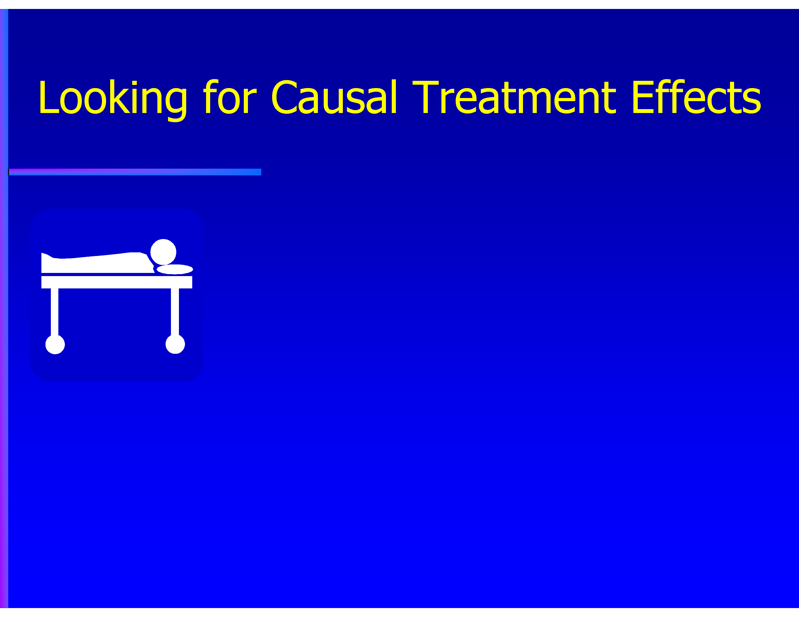

---

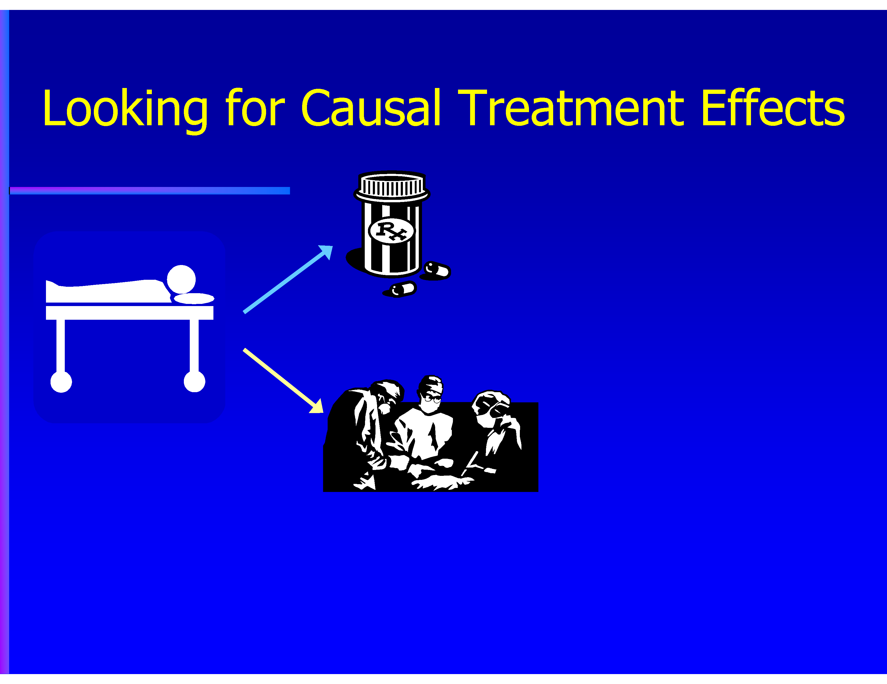

---

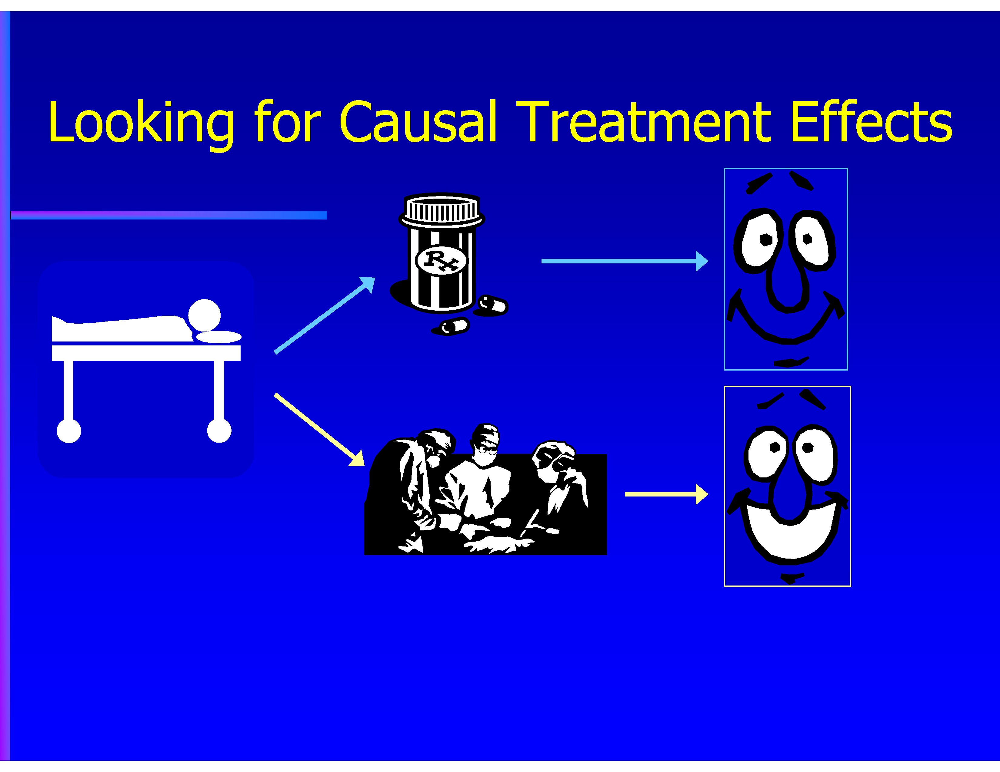

---

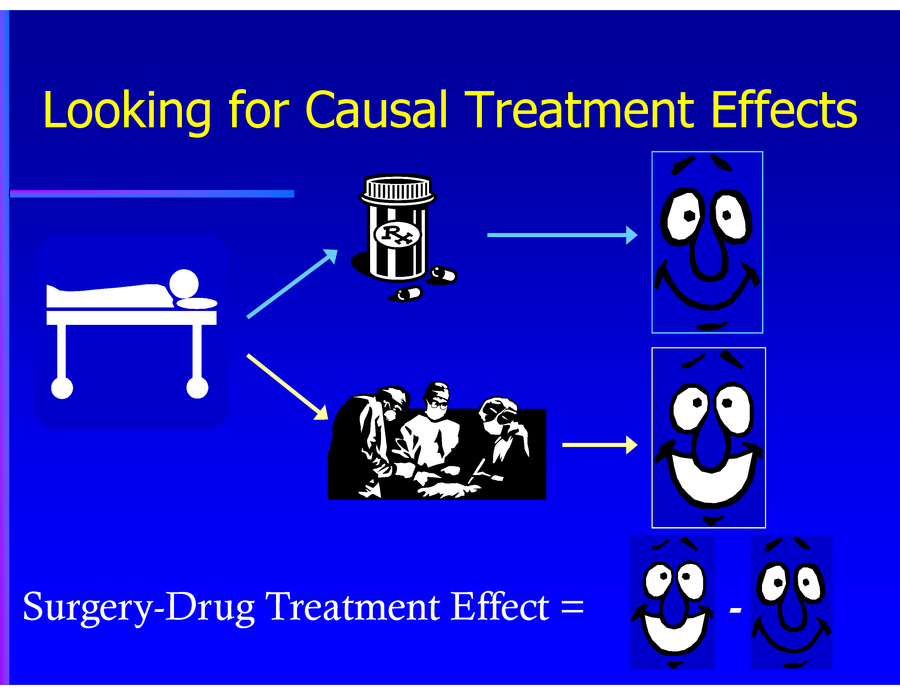

---

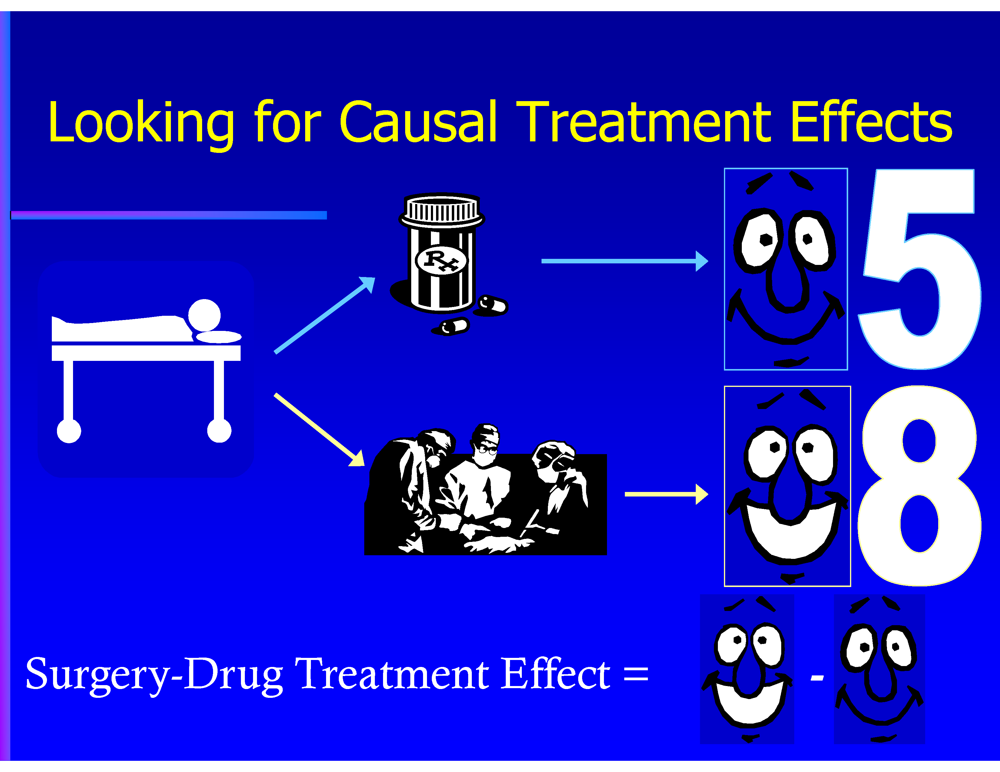

---

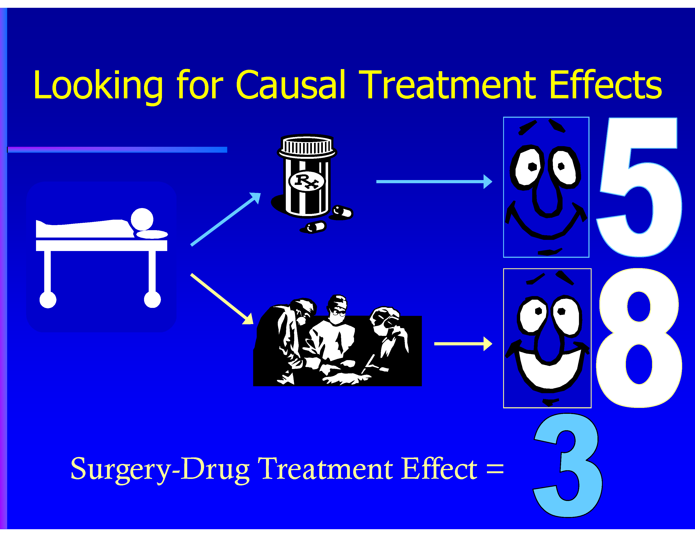

---

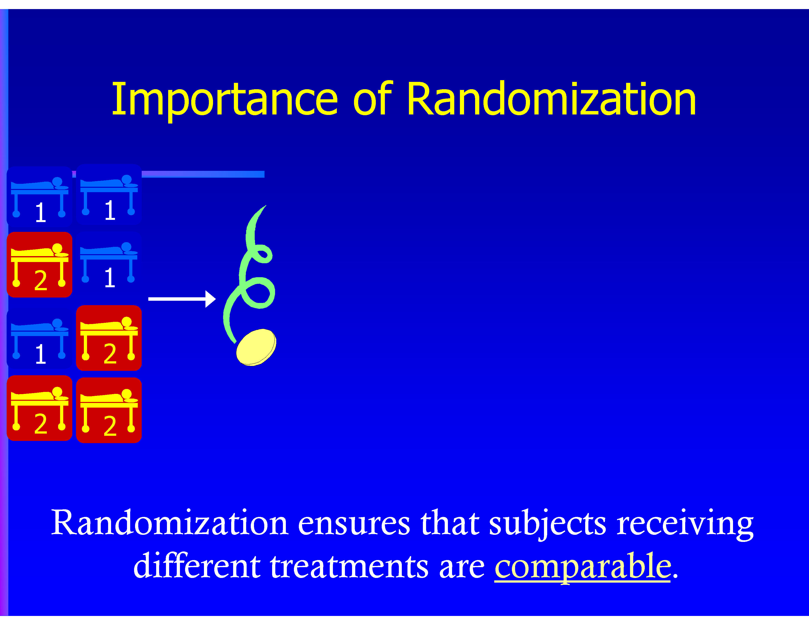

---

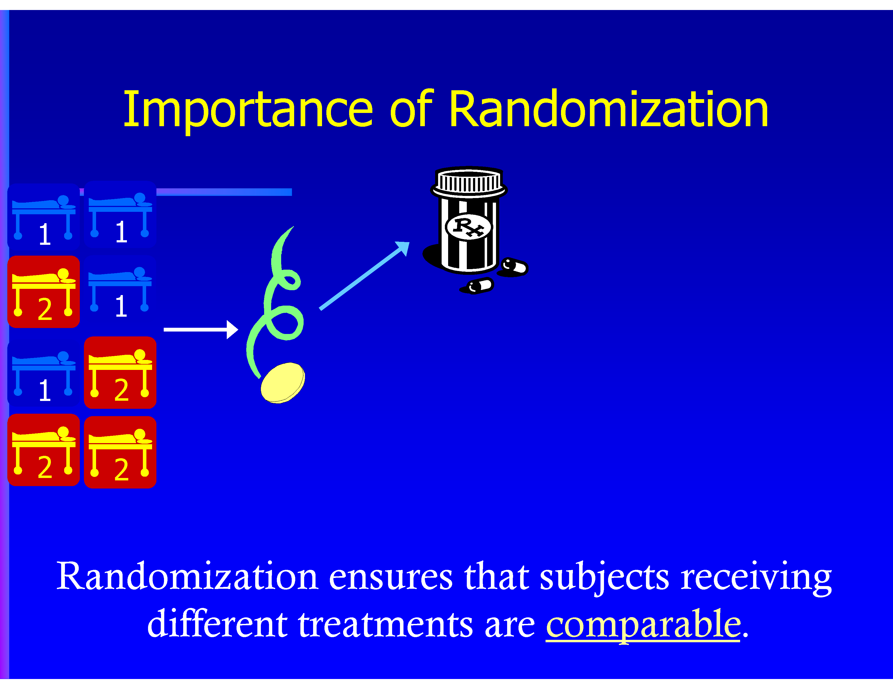

---

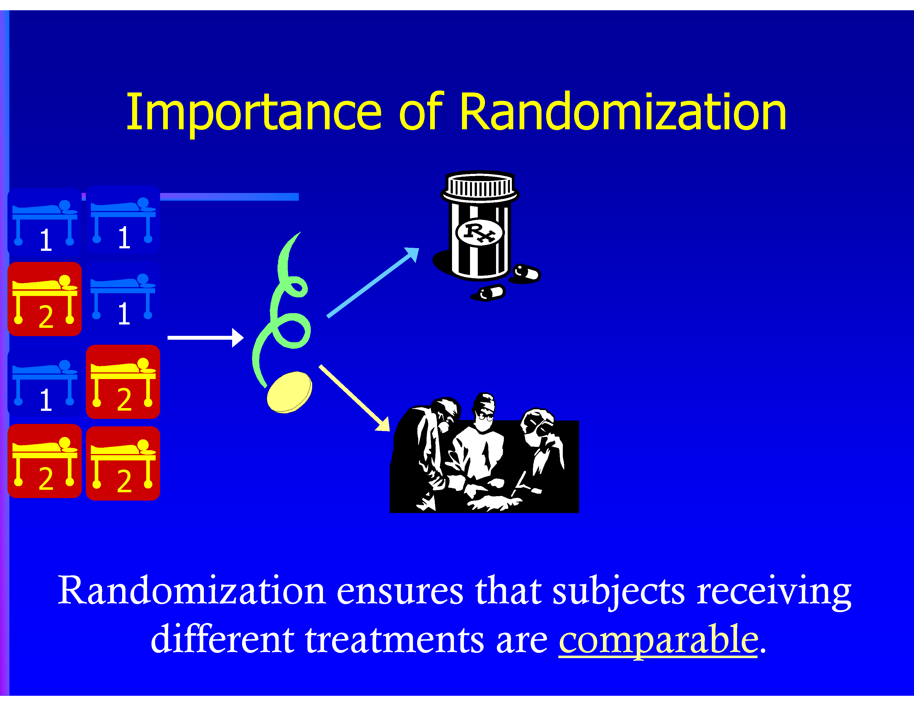

---

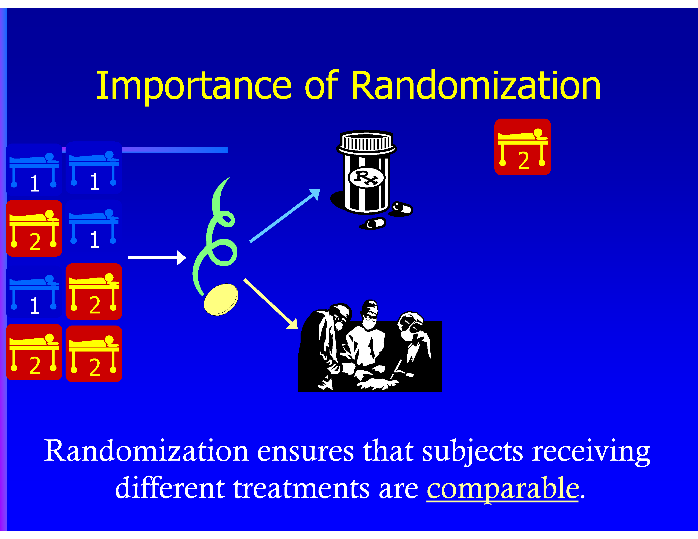

---

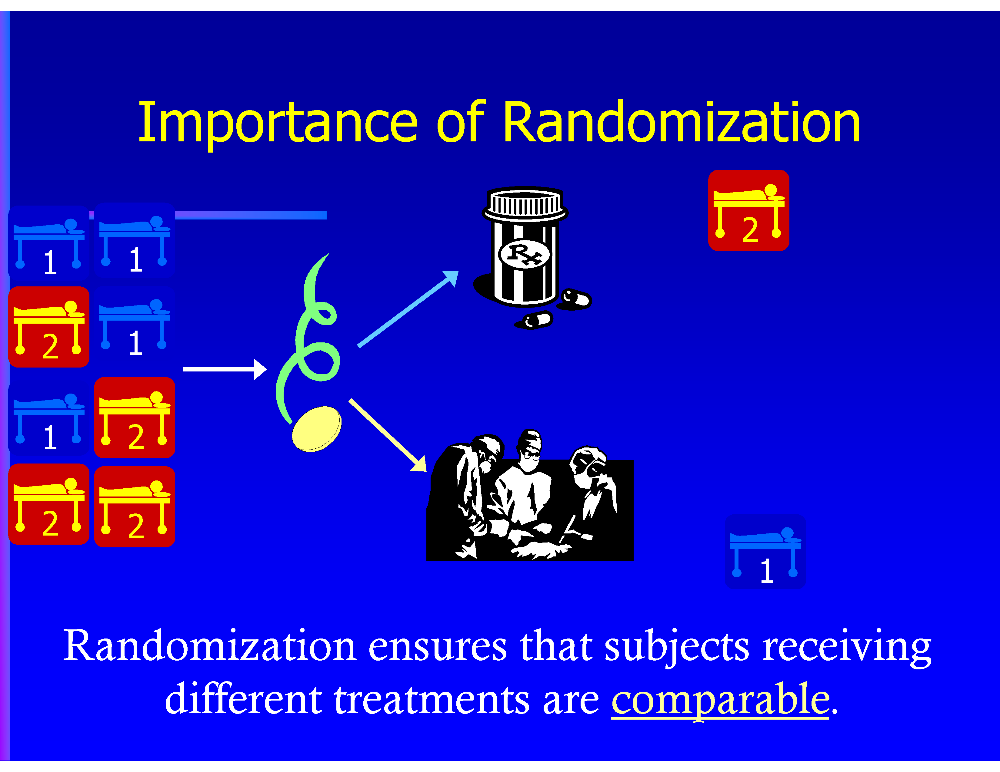

---

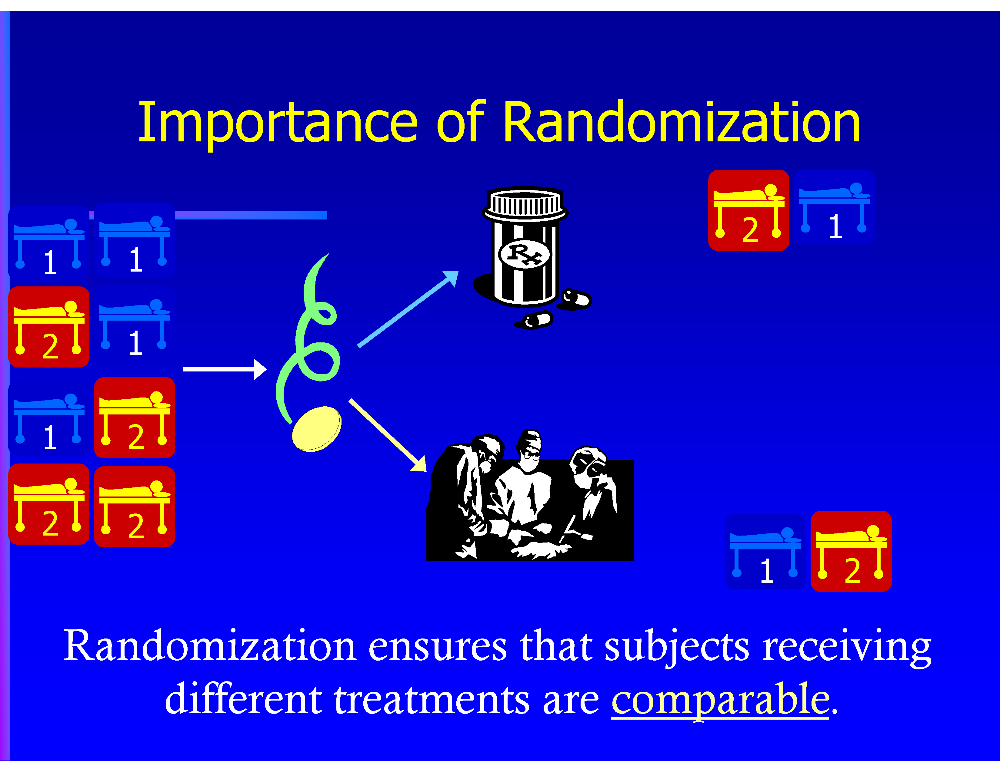

---

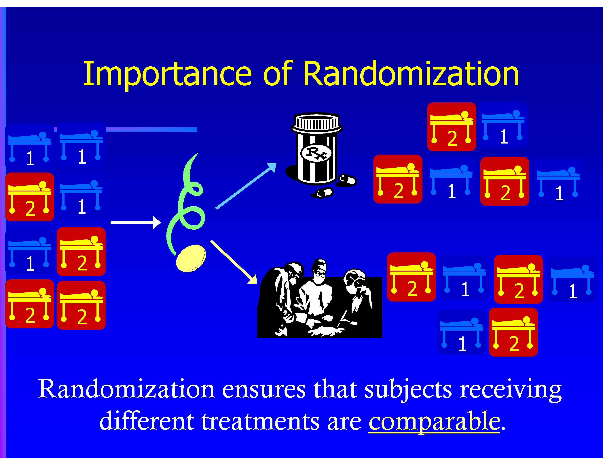

## USPSTF Evidence Grades, 2000 (see Concato)

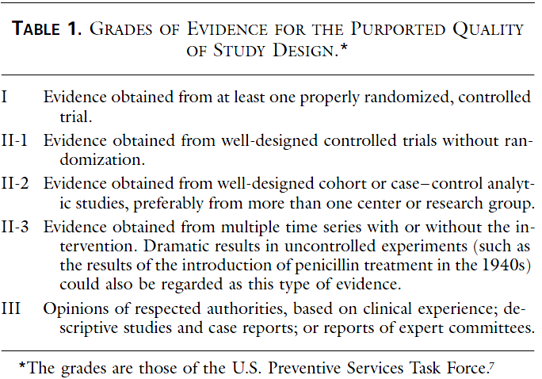

# Thinking about Randomized Clinical Trials

## The Importance of Randomization

We want to compare groups who looked similar **before** they were exposed to interventions/treatments.

- Randomization tends to produce relatively comparable or ``balanced'' treatment groups in large experiments.
    + The covariates are not used in assigning treatments in an experiment.
    + There is no *deliberate* balancing of the covariates: it's just a nice feature of randomization.
- We have some reason to hope and expect that other (unmeasured) variables will be balanced, as well.

## A Randomized Clinical Trial (RCT) of Coronary Surgery

- VA conducted a randomized controlled experiment for coronary artery disease
    + Coronary artery bypass surgery vs.
    + Medical therapy (Drug treatments)
- 596 patients at 13 VA hospitals
    + 286 got surgery, 310 got medical therapy
    + Random Assignment of Treatments
    + Were the subjects comparable? Is it appropriate to check?
- To whom do we wish to make inferences?
- What is our actual research question?

## Baseline Comparison of VA Coronary Patients RCT

Covariate (pre-treatment) | Medical \% | Surgery \%
------------------------: | ---------: | ---------:
NY Heart Assoc. Class II \& III | 94.2 | 95.4
History of myocardial infarction (MI) | 59.3 | 64.0
Definite / possible MI (electrocardiogram) | 36.1 | 40.5
Duration of chest pain > 25 mos. | 50.0 | 51.8
History of hypertension | 30.0 | 27.6
History of congestive heart failure | 8.4 | 5.2
Cardiothoracic ratio > 0.49 | 10.4 | 12.2
Serum cholesterol > 249 mg/dl \*\* | 31.6 | 20.6 

\*\* $p < 0.05$ for difference between medical and surgery groups

## Results of the VA Coronary Surgery Trial

- The VA study compared survival in the two groups three years after treatment.
    + Survival in the medical group was 87%
    + Survival in the surgical group was 88%
    + Both had a standard error of 2%, so the 1 percentage point difference in mortality was not significant
- Evidently, when comparable groups of patients received medical and surgical treatment at VA hospitals, outcomes were quite similar.

## Why wouldn't you always do experiments?

- Any thoughts?

- Are there situations where random assignment of subjects to exposures/treatments is not possible?

## Why not always do experiments?

- The treatment might be harmful and cannot be given to human subjects for experimental purposes.
- The treatment may be controlled by a political process that will not yield control.
- The treatment may be beyond the legal reach of experimental manipulation.
- Experimental subjects may have strong attachments to particular treatments.

## Why does observational inference matter?

Adapted from [Emily Riederer](https://emilyriederer.netlify.app/post/causal-design-patterns/):

- Even when you can experiment, understanding observational causal inference can help you better identify biases and design your experiments
- Testing can be expensive. 
  - There are direct costs of instituting a policy that might not be effective, implementation costs, and opportunity costs (holding out a control group and not applying what you hope to be a good strategy as broadly as possible.)
- Randomized experimentation is harder than it sounds! Sometimes experiments may not go as planned, but treating the results as observational data may help salvage some information value
- Data collection can take time. When we long to read an experiment that wasn’t launched three years ago, historical observational data can help us get a preliminary answer sooner.
- It’s not "either/or" but "both and". Due to the financial and temporal costs of experimentation, causal inference can also be a tool to help us better prioritize what experiments are worth running.

Sometimes, we have other problems...

## The MRFIT Trial

Multiple Risk Factor Intervention Trial  (*JAMA* 1982)

> The Multiple Risk Factor Intervention Trial was a randomized primary prevention trial to test the effect of a multifactor intervention program on mortality from coronary heart disease (CHD) in 12,866 high-risk men aged 35 to 57 years. 

> - Men were randomly assigned to a special intervention (SI) program or to usual care (UC)
    + SI includes stepped-care treatment for hypertension, counseling for cigarette smoking, and dietary advice for lowering blood cholesterol. 
> - Men were followed for an average of seven years
    + Risk factor levels declined in both groups, more in the SI group.
    + CHD mortality 17.9 deaths/1000 in SI, 19.3 in UC (not sig.)

## Example of RCT Subject Selection (MRFIT)

Start with 361,662 men ages 35-57

## Example of RCT Subject Selection (MRFIT)

Start with 361,662 men ages 35-57

1. Exclusions if ...
    + Low risk of CHD
    + History of MI
    + Diabetes
    + Geographic Mobility is an issue
    + Cholesterol > 350
    + DBP > 115

## Example of RCT Subject Selection (MRFIT)

Start with 361,662 men ages 35-57

1. Exclusions if ...
    + Low risk of CHD
    + History of MI
    + Diabetes
    + Geographic Mobility is an issue
    + Cholesterol > 350
    + DBP > 115

How many men do you suppose this leaves in the study?

## Example of RCT Subject Selection (MRFIT)

Start with 361,662 men ages 35-57

1. Exclusions if ...
    + Low risk of CHD
    + History of MI
    + Diabetes
    + Geographic Mobility is an issue
    + Cholesterol > 350
    + DBP > 115

These exclusions affected 336,117 of the men.

## Example of RCT Subject Selection (MRFIT)

Start with 361,662 men ages 35-57

1. Exclude 336,117 men, leaving 25,545 candidates for screening.

## Example of RCT Subject Selection (MRFIT)

Start with 361,662 men ages 35-57

1. Exclude 336,117 men, leaving 25,545 candidates for screening. 
2. Screen 25,545 men.

## Example of RCT Subject Selection (MRFIT)

Start with 361,662 men ages 35-57

1. Exclude 336,117 men, leaving 25,545 candidates for screening. 
2. Screen 25,545 men, and exclude if...
    + Body Weight is more than 150\% of expected
    + Angina
    + Evidence of MI
    + Consuming a special diet
    
How many of these 25,545 men will be left?
    
## Example of RCT Subject Selection (MRFIT)

Start with 361,662 men ages 35-57

1. Exclude 336,117 men, leaving 25,545 candidates for screening. 
2. Screen 25,545 men, and exclude if...
    + Body Weight is more than 150\% of expected
    + Angina
    + Evidence of MI
    + Consuming a special diet

And this affects 12,678 of these men.

## Example of RCT Subject Selection (MRFIT)

Start with 361,662 men ages 35-57

1. Exclude 336,117 men, leaving 25,545 candidates for screening. 
2. Screen 25,545 men, and exclude 12,678.
3. Take the remaining sample of 12,866 and randomize into ...
    + one group of 6,428 men
    + and the other group of 6,438 men

Bottom Line: MRFIT excluded 96.4\% of potential eligibles.

## Smith and Pell, BMJ 2003

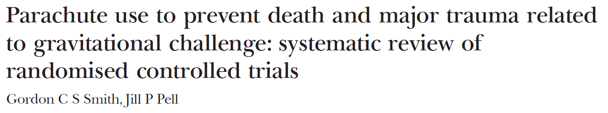

## Smith and Pell, BMJ 2003

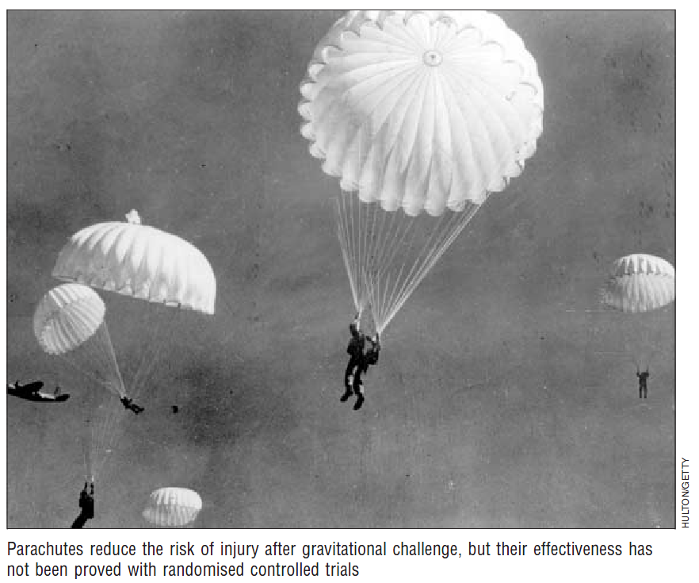

---

**It is a truth universally acknowledged that a medical intervention justified by observational data must be in want of verification through a randomized controlled trial.**

Observational studies have been tainted by accusations of data dredging, confounding, and bias. 

- For example, observational studies showed lower rates of ischaemic heart disease among women using hormone replacement therapy, and these data were interpreted as advocating hormone replacement for healthy women, women with established ischaemic heart disease, and women with risk factors for ischaemic heart disease.
- However, randomised controlled trials showed that hormone replacement therapy actually increased the risk of ischaemic heart disease, indicating that the apparent protective effects seen in observational studies were due to bias. 

Cases such as this one show that medical interventions based solely on observational data should be carefully scrutinised, and the parachute is no exception.


## The ``Healthy Cohort'' Effect, from Smith and Pell

One of the major weaknesses of observational data is the possibility of bias, including selection bias and reporting bias, which can be obviated largely by using randomised controlled trials. The relevance to parachute use is that individuals jumping from aircraft without the help of a parachute are likely to have a high prevalence of pre-existing psychiatric morbidity.  

Individuals who use parachutes are likely to have less psychiatric morbidity and may also differ in key demographic factors, such as income and cigarette use. 

It follows, therefore, that the apparent protective effect of parachutes may be merely an example of the ``**healthy cohort**'' effect. Observational studies typically use multivariate analytical approaches, using maximum likelihood based modeling methods to try to adjust estimates of relative risk for these biases. 

Distasteful as these statistical adjustments are for the cognoscenti of evidence based medicine, no such analyses exist for assessing the presumed effects of the parachute.

## from Smith and Pell

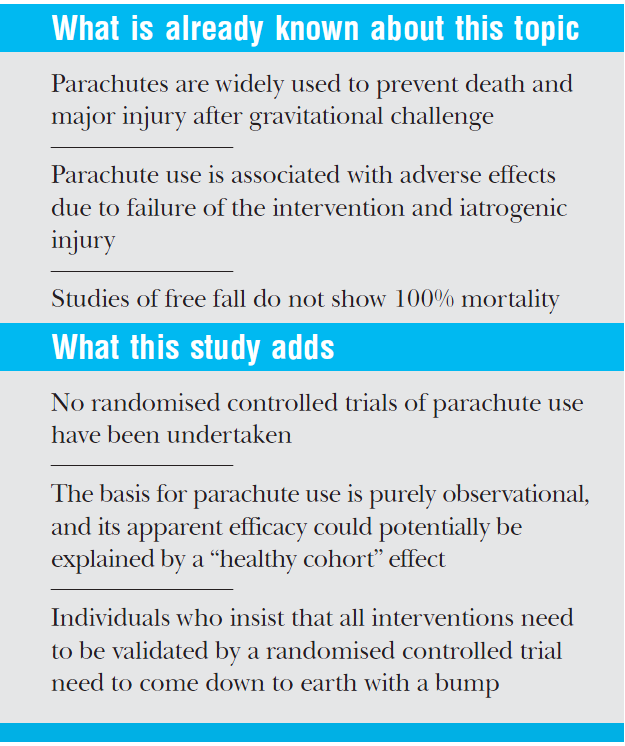 

## A call to (broken) arms

Only two options exist. 

The first is that we accept that, under exceptional circumstances, common sense might be applied when considering the potential risks and benefits of interventions. 

The second is that we continue our quest for the holy grail of exclusively evidence based interventions and preclude parachute
use outside the context of a properly conducted trial.

The dependency we have created in our population may make recruitment of the unenlightened masses to such a trial difficult. If so, we feel assured that those who advocate evidence based medicine and criticise use of interventions that lack an evidence base will not hesitate to demonstrate their commitment by volunteering for a double blind, randomised, placebo controlled, crossover trial.

> Smith and Pell, 2003

## Contributors

GCSS had the original idea. JPP tried to talk him out of it. 

JPP did the first literature search but GCSS lost it. 

GCSS drafted the manuscript but JPP deleted all the best jokes. 

GCSS is the guarantor, and JPP says it serves him right.

# Thinking More About Observational Studies

---


---

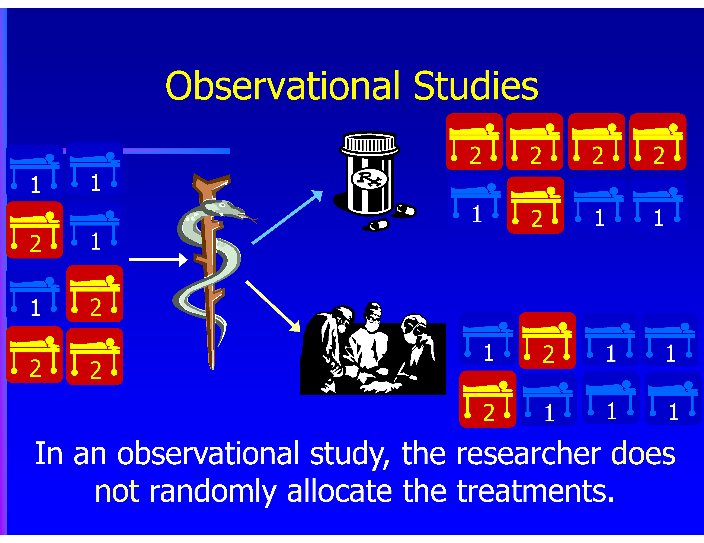

## Without Randomization ...

We still want to compare groups who looked similar **before** they were exposed to our treatments.

- But we don't control the assignment of treatments.
    + Cannot use randomization to ensure comparability
- So how, then, do we make fair comparisons?
    + Analytical adjustments to account for baseline (covariate) differences in the groups.
    + A study is **biased** if the treatment groups differ in ways that matter for the outcome we're studying.
    
## Observational Studies to Estimate Causal Effects

- An observational study (OS) concerns treatments and their effects, BUT the researcher does not control (cannot randomize) the assignment of treatments
- We want to compare groups receiving the two treatments who looked similar prior to the treatment assignment.
- Analytical adjustments required to account for baseline (covariate) differences.

## Data Collection Strategies

- Experiments require active intervention by the investigator.  
- An OS is more passive, but often attempts to look at the same sort of effect.
   + Retrospective trials observe responses on carefully selected subjects, whose history is then examined to assess which variables are important in determining the condition of interest.
   + Prospective trials are safer, more time-consuming.

## USPSTF Grade Definitions (2012)


https://www.uspreventiveservicestaskforce.org/Page/Name/grade-definitions

---


## "Simple" Observational Studies

- We have an outcome measured on two groups of subjects (treated and control).
- We want to make a fair comparison between the treated group and the control group in terms of the outcome.
- We can obtain covariates that describe the subjects before they received treatments, but we **can't ensure** that the groups will be comparable in terms of the covariates.

## The Key Role of Assumptions

We'd like to describe cause-effect relationships from non-experimental data. This is challenging.

> ... the elucidation of causal relationships from observational studies must be shaped by knowledge (or assumptions) about how the data were generated; such assumptions are crucial to causal inference.

> - Judea Pearl (2000) Causal Inference in the Health Sciences: A Conceptual Introduction *Health Services & Outcomes Research Methodology* 2: 189-220.

## How Randomization Works

1. Identify experimental units.
    + Inferences refer only to these units, typically.
2. Define a collection of possible assignments of treatments to units.
    + Exclude unreasonable assignments from the collection.
3. Define a stochastic mechanism for selecting one assignment from the collection.
    + Complete randomization vs. Blocked randomization
    + Biased coin / ``balancing'' randomization
4. Select one assignment from the collection using the mechanism.
5. Use the stochastic mechanism as the sole basis for inference.

## Randomized vs. Non-Randomized Studies

- In a non-randomized study, we'd no longer KNOW the distribution of treatment assignments.
- We need to make some assumption about the distribution in order to make inferences.
- Moreover, there may be little basis on which to ground or defend this assumption.  It may be wrong, or open to challenge.

## The Role of Assumptions

Scenario | Goal of Analysis | Role of Assumptions
:--------: | :----------------: | :------------------:
Randomized | Testing $H_0$: | 
Experiments | No treatment effect | None


## The Role of Assumptions

Scenario | Goal of Analysis | Role of Assumptions
:--------: | :----------------: | :------------------:
Randomized | Testing $H_0$: | 
Experiments | No treatment effect | None
 | | 
Randomized | Estimating treatment | 
Experiments | effects, CIs | Minor
 | | 


## The Role of Assumptions

Scenario | Goal of Analysis | Role of Assumptions
:--------: | :----------------: | :------------------:
Randomized | Testing $H_0$: | 
Experiments | No treatment effect | None
 | | 
Randomized | Estimating treatment | 
Experiments | effects, CIs | Minor
 | | 
Observational | |
Studies | Anything | **MASSIVE**

## Why are Experiments *Better* Than Observational Studies?

Scientific questions are not settled on a particular date by a single event.  Rather, we speak of the ``weight of evidence.''

- Experiments leave fewer grounds for doubt.
- Experiments often settle questions faster.
- Uncertainty about treatment effects is greater in the absence of randomization.
- With observational studies, we are especially concerned about sensitivity to hidden bias.

## Advantages of **Smart** Observational Studies

- Address chief criticism of randomized trials: limited generalizability / external validity
- Enable examination of exposure in ``real life''
- May enable examination of effect size and ``entrenched practices''
- Broader array of exposures and outcomes can be explored with an observational study than in controlled experiments.
- Due to frequently large size, can provide information about exposures with small effect sizes (toxicity of treatments)
- Data are widely (increasingly) available
- Often reduced cost and time to get answer

BUT No randomization forces the investigator to think hard about **how exposures were assigned** or determined.

## Characteristics of Excellent Observational Studies

- Careful choice of research hypothesis: narrow, controlled examination of a broad theory
- Use of a control group (subjects who did not receive the treatment) carefully selected
- Careful choice of treatment: Sharply distinct treatments that could happen to anyone
- Competing **theories**, not just $H_0$ and $H_A$: desirability of multiple working hypotheses.

# A Motivating Example (Aspirin and Mortality)

## Aspirin and Mortality in Heart Patients

Suppose you want to understand the effect of aspirin (acetylsalicylic acid: ASA) on mortality among patients undergoing stress echocardiography.

- What is the population?
- What is the outcome?
- What are the treatments?

##


##


##


## ASA and Mortality in Heart Patients

Suppose you want to understand aspirin's effect on all-cause five-year mortality among patients undergoing stress echocardiography.

- Comparing ASA to "No ASA"
- What are the potential outcomes here?

##


##


##


## ASA and Mortality in Heart Subjects

- Suppose you want to study the effect of aspirin (acetylsalicylic acid: ASA) on all-cause mortality.
- You identify an interesting group of Subjects as those undergoing stress echocardiography.
    - Your goal is to compare ASA Subjects to "no ASA" Subjects

What would be the **ideal** study?

Step 1. Identify a large group of Subjects from the population at Time 0.

- We want to understand the causal effect of aspirin on all-cause five-year mortality among patients undergoing stress echocardiography.
- Having identified a set of patients, what is the ideal study?

Step 2?

##


##


##


##


##


##


##


##


##


##


##


##


##


##


##


##


##


## ASA and Mortality in Heart Patients

- Designing the Study

We want to understand aspirin's effect on all-cause five-year mortality among patients undergoing stress echocardiography.

- OK.
- What's the best **practical** study?

##


##


##


##


##


##


##


## ASA and Mortality in Heart Patients

- Designing the Study

We want to understand aspirin's effect on all-cause five-year mortality among patients undergoing stress echocardiography.

- But what if we **cannot** do an RCT?

##


##


##


##


##


##


##


## How Do We Avoid Being Misled?

- What differentiates an observational study from a randomized controlled trial?
    - One key element: potential for selection bias.
- What is selection bias and what can we do about it?
    - Baseline characteristics of comparison groups are different in ways that affect the outcome.

We will often distinguish between overt and hidden bias. 

- Overt Bias (seen in data - propensity scores can help)
- Hidden Bias (required data not collected - requires sensitivity analyses)

## Aspirin Use and Mortality - The Real Study

6174 consecutive adults at CCF undergoing stress echocardiography for evaluation of known or suspected coronary disease\footnote{Gum PA et al. 2001}.

- 2310 (37\%) were taking aspirin (treatment).
- Main Outcome: all-cause mortality 
    + Median follow-up: 3.1 years
- Univariate Analysis: 4.5\% of aspirin patients died, and 4.5\% of non-aspirin patients died.
    + Unadjusted Hazard Ratio: 1.08 (0.85, 1.39)

More on this study to come.

## Next Class - Thursday 2021-02-11

Pre-recording will appear on our Shared Google Drive, discussing 

- How Can We Avoid Being Misled by Observational Studies?
    + What is **selection bias** and why should I care about it?
    + What can be done to deal with selection bias in observational studies?
- What is a propensity score, and how do we ... 
    + estimate it, 
    + see how well it's working, and
    + use it to estimate causal effects?

The slides I use will be posted to the Class 02 README.

## Next Class - Thursday 2021-02-11

We'll meet via Zoom from 9:30 AM to 10:45 AM. Key things we'll discuss include:

- Lab 1
    1. Mock Proposals from the DIG study (be ready to share)
    2. Analyzing Data - building a logistic regression model (don't forget about the Lab 0 example and the R-basics materials)
- Rosenbaum (2017) Chapters 1-2 (Part I. Randomized Experiments)
    1. A Randomized Trial
    2. Structure
    3. (Class 3) Causal Inference in Randomized Experiments
    4. (Class 4) Irrationality and Polio
