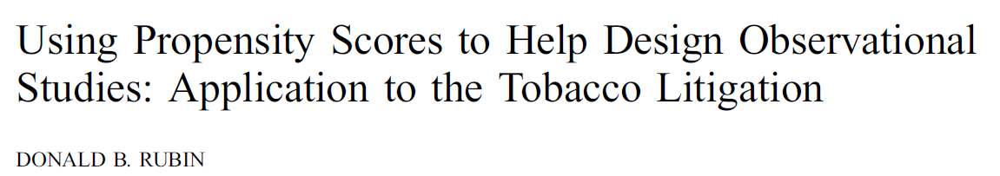
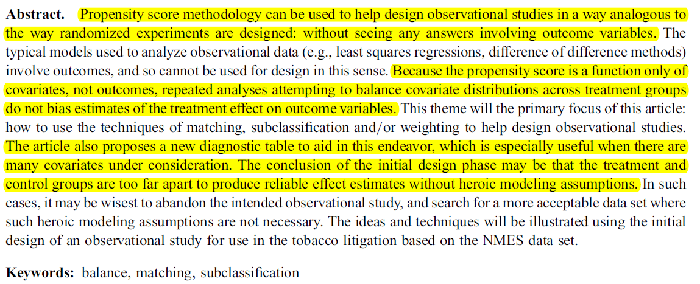
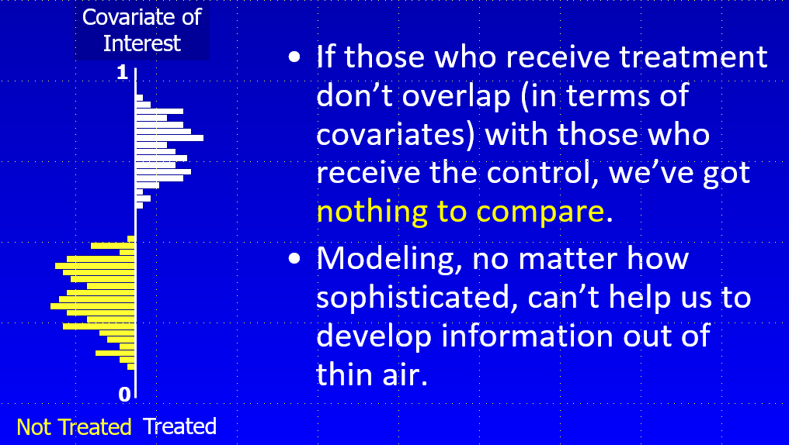
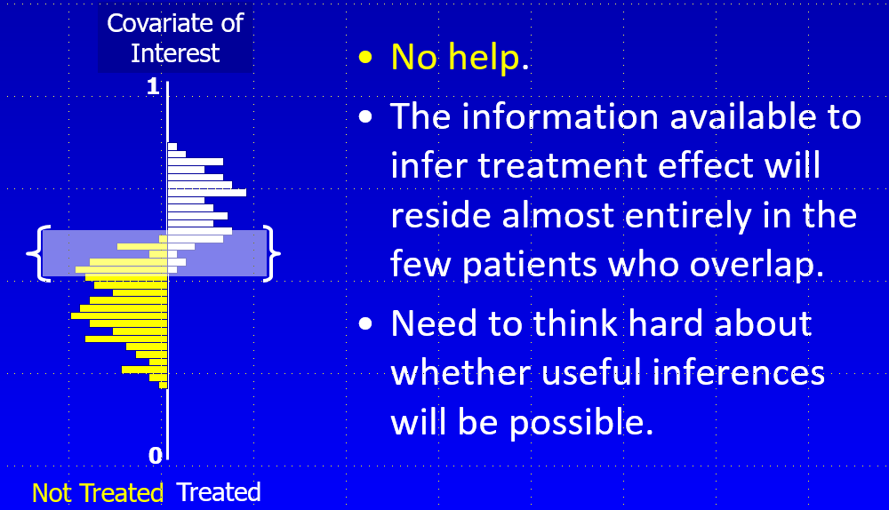
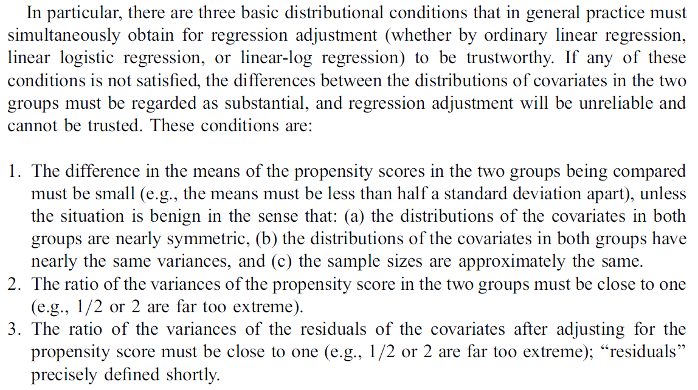
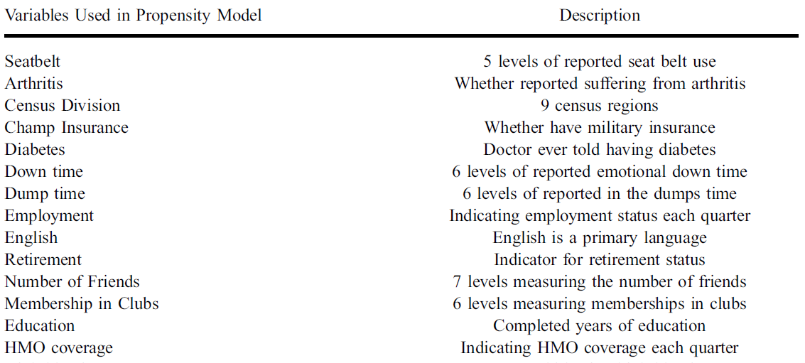
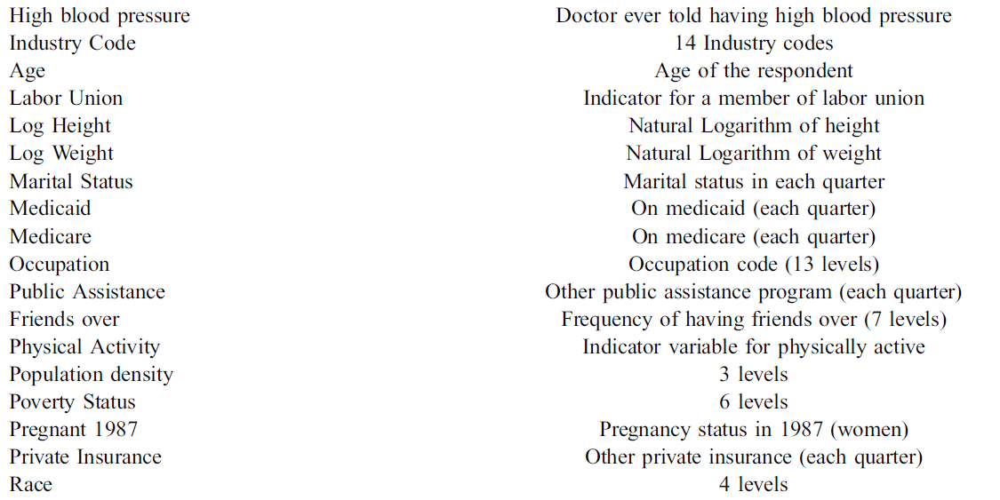
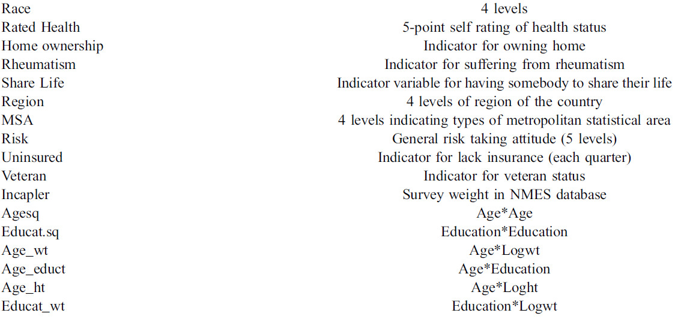
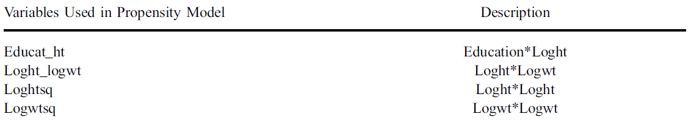
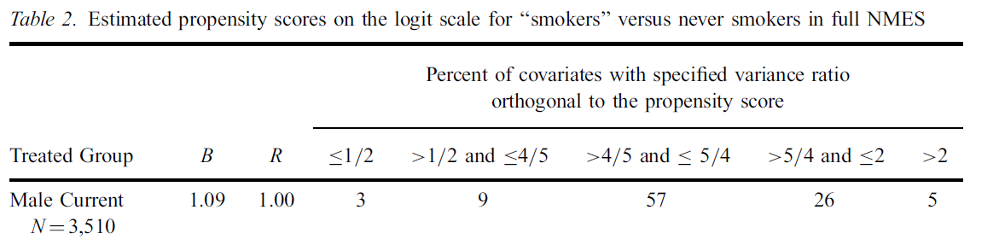

```{r, echo = FALSE}
library(knitr)
opts_chunk$set(comment = NA)
```

## Agenda for Today's Pre-Recorded Lecture

- The Right Heart Catheterization Example: A Brief Intro
- Designing Observational Studies (Rubin, 2001)

# The Right Heart Catheterization Example (Connors 1996)

## The SUPPORT Study

This example is based on the Right Heart Catheterization data set available at Vanderbilt University and described here. The key reference is Connors AF et al. (1996) The effectiveness of RHC in the initial care of critically ill patients. JAMA 276: 889-897. 

Connors et al. used a logistic regression model to develop a propensity score then: [a] matched RHC to non-RHC patients and [b] adjusted for propensity score in models for outcomes, followed by a sensitivity analysis. 

The key conclusions were that RHC patients had decreased survival time, and any unmeasured confounder would have to be somewhat strong to explain away the results.

## What's in the RHC Example?

- exposure/treatment is the installation of a Swan-Ganz (right heart) catheter on day 1
- 3 outcomes 
  - binary: in-study mortality
  - quantitative: hospital length of stay, in days
  - time-to-event: time to death (with censoring)
- 50 covariates, including socio-demographics, presentation and diagnoses at admission, comorbid illness and transfer status, summary measures of presentation and lab results on day 1

## What Analyses are Presented?

- Unadjusted analyses
- Estimating the PS and checking balance before adjustment
- Six different Matching Approaches and resulting outcomes
  - 1:1 greedy matching without replacement
  - 1:2 greedy matching without replacement
  - 1:1 matching without replacement using genetic search
  - 1:1 greedy matching with replacement
  - 1:1 caliper matching without replacement
  - 1:2 greedy matching with replacement
- Sensitivity Analyses after Matching

# Designing Observational Studies (Rubin 2001)

## On Designing Observational Studies

- Exert as much experimental control as possible
- Carefully consider the selection process
- Actively collect data to reveal potential biases

> "Care in design and implementation will be rewarded with useful and clear study conclusions... Elaborate analytical methods will not salvage poor design or implementation of a study."  -- NAS report (quoted in Rosenbaum p. 368)

But **HOW**?

## Rubin 2001

On Designing an Observational Study with the Propensity Score



## Rubin 2001 Abstract



## Designing an Observational Study without access to the outcome data

- Propensity score methods can be used to help design the OS without seeing any outcomes.
    + Propensity score is a function only of covariates, not of outcomes.


### The key insight from Rubin (2001) 

Repeated analyses attempting to balance covariate distributions across treatment groups **do not bias** estimates of the treatment's effect on outcome variables.


## Designing Observational Studies

- The Importance of Covariate (PS) Overlap 
- How To Check for Overlap Effectively
- Designing Like You're Doing an Experiment
- Using Matching, Subclassification and Weighting
- Propensity Scores are "Fair Game" - No Outcomes!

In order to extract information on treatment effect from an observational study, we need for to be able to compare "identical" people who receive different treatments. 

**Goal**: Use propensity scores to assemble treatment groups that have comparable distributions on all measured covariates.

**Issue 1**: Overlap

## How much overlap in the covariates do we want?



## What if the exposure groups overlap, but minimally?



## Initial Phases of Ideal Study Design

Specify population, exposures/treatments, outcomes and covariates.

- Collect treatment and covariate information, and model treatment assignment with the propensity score.
- Use propensity scores (through matching, stratification, reweighting) to reduce bias.
- Check for covariate balance across the treatment groups and iterate through process.
    + If the treatment and control groups have the same distribution of propensity scores, then they have the same distribution of all observed covariates, just as in a randomized experiment.
    + Of course, propensity scores are only guaranteed to balance the observed covariates, while randomized experiments can stochastically balance unobserved, as well.

## Rich and Poor Covariate Sets

- With a rich set of covariates, adjustments for hidden covariates may be less critical.
- With less rich covariate sets, we may need to do more, say, try to find an instrument.

As Rubin mentions in the Abstract, our conclusion after the initial design stage may be that the treatment and control groups are too far apart to produce reliable effect estimates without heroic modeling assumptions.

## Techniques for Initial Observational Study Design using Propensity Scores

- Matching
- Subclassification / Stratification
- Weighting

**Goal**: Assemble groups of treated and control units such that within each group the distribution of covariates is balanced.

Allows us to attribute outcome differences to the effect of treatment vs. control.

## Why Work this Hard in the Initial Design Stage?

- Options narrow as an investigation proceeds.
- No harm, no foul.
    + Since no outcome data are available to the PS, nothing based on the PS here biases estimation of treatment effects.
- Balancing covariates / PS makes subsequent model-based adjustments more reliable.

Key point is that model adjustments can be extremely unreliable when the treatment groups are far apart on covariates. So we need to avoid that. 

"Balancing" helps in terms of assessing covariance, relative risk, subsequent adjustments, etc.


## Propensity Score **Matching** in the Design of an Observational Study

- Pair up treated and control subjects with similar values of the propensity score, discarding all unmatched units.
    + Not limited to 1-1 matches, can do 1-many, etc.
- Can find an *optimal* full match using `optmatch` in R, without discarding any units, then follow with adjustments.
    + Technically more valid, but difficult sell in practice.
- Common: One-one Mahalanobis matching within calipers defined by logit(propensity).

## Propensity Score **Subclassification** in the Design of an Observational Study

- Rank all subjects by their propensity score and then create subclasses by imposing boundaries.
- Subclasses therefore have treated and control units with similar values of propensity score.
- Often use 5 subclasses of equal size should remove 90% or more of the bias due to the observed covariates in the propensity score.

## Propensity Score **Weighting** in the Design of an Observational Study

Estimate propensity scores for each subject, so that PS = prob(treatment received | covariates)

Rubin describes the ATE approach to weighting...

- Weights for treated subjects: $\frac{1}{PS}$. 
- Weights for control subjects: $\frac{1}{1-PS}$

## When Can We Move On?

Three conditions which must all apply for regression adjustment to be trustworthy:

1. Difference in the means of linear propensity score [logit(PS)] in the two groups being compared must be small.
2. Ratio of variances of linear propensity scores in the two groups must be close to 1.
3. Ratio of variances of the "residuals" of the covariates after PS adjustment close to 1.

These are what I have referred to as "Rubin's Rules"...

## Three Rules (page 174, Rubin 2001)



## Assessing Balance on the *Linear* rather than *Raw* Propensity Score

- *logit*(PS) is more relevant for assessing whether linear modeling adjustments work.
- *logit*(PS) tend to have more benign (variances closer, greater symmetry) distributions.
- *logit*(PS) are more closely related to benchmarks in the literature on adjustments for covariates based on linearity assumptions.

## Putting Rubin's Rule 1 into operation

1. Difference in the means of the propensity scores in the two groups being compared.
    + Estimate propensity scores for all subjects.
    + Take logit(PS) for each subject (normalize).
    + Find SD = standard deviation of logit(PS) across all subjects (treated and control).
    + Mean logit(PS) for treated group should be within 0.5 SD of control group's mean logit(PS). 
    + Often we calculate a standardized difference here.

```
rubin1.unadj <- with(toy, abs(100*(mean(linps[treated==1]) - 
                                     mean(linps[treated==0])) / 
                                       sd(linps)))
```

## Putting Rubin's Rule 2 into operation

2. Variance ratio of propensity scores in the two groups being compared should be close to 1.
    + Estimate propensity scores for all subjects.
    + Take logit(PS) for each subject (normalize).
    + Find variance of logit(PS) across treated subjects, and divide it by the variance of logit(PS) across control subjects.
    + Variance ratio should be close to 1. Ratios of 0.5 and 2.0 are far too extreme: we often try for (4/5, 5/4).
    
```
rubin2.unadj <-with(toy, var(linps[treated==1]) /
                          var(linps[treated==0]))
```

## Putting Rubin's Rule 3 into operation

3. Variance ratio of "residuals" close to 1.
    + Estimate propensity scores for all subjects.
    + For each covariate, regress the original value of the covariate for each subject on logit(PS) and take the residual of this regression.
    + For each covariate, divide variance of the residuals within treatment group by variance of the residuals within  control group.
    + For each covariate, this variance ratio should also be close to 1 (2 or 0.5 are, again, far too extreme).

## `rubin3` function built for the `toy` example

```
## General function rubin3 to help calculate Rubin's Rule 3
rubin3 <- function(data, covlist, linps) {
  covlist2 <- as.matrix(covlist)
  res <- NA
  for(i in 1:ncol(covlist2)) {
    cov <- as.numeric(covlist2[,i])
    num <- var(resid(lm(cov ~ data$linps))[data$treated==1])
    den <- var(resid(lm(cov ~ data$linps))[data$treated==0])
    res[i] <- round(num/den, 3)
  }
  names(res) <- names(covlist)
  print(res)
}
```

## National Medical Examination Survey

- Large nationally representative data base of nearly 30,000 adults, calendar year 1987
- Modern related efforts are folded into [NHANES](http://www.cdc.gov/nchs/nhanes.htm)

**Goal**: objective observational study on the causal effects of smoking and the effect of the tobacco companies' alleged misconduct

## NMES Covariates for Smoking Study

- Age, Sex, Race, Marital Status, Education, etc.
- Detailed smoking information
    + Classification of subjects as never smokers, former smokers and current smokers
    + Further classifications possible by length and density of smoking behaviors
    + Also can look at years since quitting for former smokers

## NMES Objects of Inference

- Smoking Attributable Fractions
- Conduct Attributable Fractions
- Relative Expenditure Risks

All based on comparisons of specific health-related expenditures (or disease rates) 

Comparisons of smokers with "never smokers" who have same covariate values, as a function of dosage and covariates

## Rubin's Main Example

**Design Goal**: Create samples of smokers and never smokers in NMES with the same multivariate distribution of covariates.

- Males and Females treated separately.
- We'll focus first on Male "Current Smokers" vs. Male "Never Smokers"
    + 3510 Male "Current Smokers" in the pool
    + 4297 Male "Never Smokers"" as controls
- Fit propensity for "current smoker" to these people, via logistic regression with sampling weights

Separate models were built for "former vs. never (Males)" and the two analogous comparisons of Females.

## Propensity Model: 146 Covariates



## Propensity Model: 146 Covariates



## Propensity Model: 146 Covariates



## Propensity Model: 146 Covariates



## Assessing Overlap Step 1: Looking for Mean Bias

Bias B = standardized difference in the means of logit(propensity scores) between current smokers and never smokers for males 

- We want the bias in the propensity score to be small, no greater than 0.50 in absolute value.
- Here, mean propensity score Bias B = 1.09 (109%)
- In fact standardized difference > 0.5 (50%) for many of the individual covariates, as well.

## Assessing Overlap Step 2: Comparing Variances

Ratio R = ratio of the variances of logit(propensity scores) between current smokers and never smokers for males.

- We want the variances to be homogeneous, so the ratio should be close to 1 (1/2 and 2 are far too extreme).
- Here, variance ratio for logit(PS) is R = 1.00
- Could look at ratio of individual covariate variances, also. (In fact, `MatchBalance` does this.)

## Assessing Overlap Step 3: Comparing Residuals

Regress each covariate on logit(PS) and look at ratio of variances of residuals for current smokers to variance of residuals for never smokers within the male population.

- Here, we get a separate result for each of the 146 covariates. We want results near 1.00
    + 57% of the covariates had their residual ratio between 4/5 and 5/4
    + 5% of covariates had their residual ratio below 1/2, or above 2

## Excerpt from Rubin's Table 2 (page 179)




**Interpretation**

> "... [A]ny linear (or part linear) regression model cannot be said to adjust reliably for these covariates, even if they were perfectly normally distributed. ... B [is] greater than 1/2, and many of the value of R for the residuals of the covariates are outside the range (4/5, 5/4)."

## Similar Results for the Other Study Comparisons


All four comparisons indicate the need for propensity score adjustments.

## Mahalanobis Matching within PS Calipers

For the 3510 male current smokers, 3510 "matching" male never smokers were chosen from the pool of 4297 male never smokers.

- Method: Mahalanobis metric matching within propensity score calipers ($\pm$ 0.2 of the standard deviation of linear propensity scores)
    + Mahalanobis distance variables were: age, education, body mass index, and sampling weight.
    + Some of these are survey results, mostly (but not completely) in categories.
- In this case, there were no current smoker Males that could not be matched within the PS calipers to never smoker Males.
    + What if there had been a treated subject whose propensity score was not "matchable"?
    + What if the "donor pool" of never smokers had been empty for one of the current smokers?

## Impact of Matching on Overlap

**Male Current Smokers vs. Male Never Smokers**

Scenario | Bias, B | Variance Ratio, R 
--------:| :-:| :-:
Before Matching | 1.09 | 1.00
After Matching | 0.08 | 1.16

Residual Variance Ratios (% in range)

Range | Before Match | After Match
-------: | --------: | --------:
$\leq 0.5$ | 3 | 1
($\frac{1}{2}, \frac{4}{5}$] | 9 | 3
($\frac{4}{5}, \frac{5}{4}$] | **57** | **90**
($\frac{5}{4}, 2$] | 26 | 6
$> 2$ | 5 | 0


## Matching's Impact on Overlap

**Male Former Smokers vs. Male Never Smokers**

Scenario | B | R | Res. VR in ($\frac{4}{5}, \frac{5}{4}$] 
--------:| :-:| :-: | --
Before Match | 1.06 | 0.82 | 61% of covariates
After Match | 0.04 | 0.99 | 94%

## Female Comparisons re: Matching

Female **Current** Smokers vs. Female Never Smokers

Scenario | B | R | Res. VR in ($\frac{4}{5}, \frac{5}{4}$] 
--------:| :-:| :-: | --
Before Match | 1.03 | 0.85 | 59% of covariates
After Match | 0.04 | 0.94 | 93%

Female **Former** Smokers vs. Female Never Smokers

Scenario | B | R | Res. VR in ($\frac{4}{5}, \frac{5}{4}$] 
--------:| :-:| :-: | :--:
Before Match | 0.65 | 1.02 | 85%
After Match | 0.06 | 1.02 | 91%

## Re-estimating PS using Matched Subjects Only

Original propensity score estimate used all of the subjects, including those subjects who wound up being unused controls, once we matched.

- Here, they are no longer concerned with unmatched "never smokers" so they re-estimate the propensity score using only the matched samples, then look at the remaining covariate imbalance.

Group | B | R | Res. VR in ($\frac{4}{5}, \frac{5}{4}$] 
--------:| :-:| :-: | :--:
Male, Current | 0.39 | 1.33 | 88%
Male, Former | 0.32 | 1.33 | 95%
Female, Current | 0.35 | 1.18 | 92%
Female, Former | 0.31 | 1.09 | 91%

Looks better. Suppose we are still not satisfied, though.

## Subclassification of Matched Samples

Suppose we are still not satisfied...

Create two equal-size (weighted) subclasses, low and high on the linear PS.

- Treated and Control subjects with low PS are to be compared to each other.
- Treated and Control subjects with high PS are to be compared to each other.
- Weighted average of two comparisons yields the result.

## Subclassification as Re-Weighting

- For the treated subjects, the new weights implied by this subclassification are the total (weighted) number of treated and controls in that subclass, divided by the total (weighted) number of treated subjects.
- For the control subjects, weights are the subclass total of treated & controls divided by subclass controls.

Leads to a weighted PS analysis that reflects the additional balance due to subclassification.

- The same idea for weighting works no matter how many subclasses
    + One subclass is what we've had - no subclassification adjustment, just matching.
    + We'll also look at the impact of incorporating 2, 4, 6, 8, or 10 subclasses after matching...
    
## Current vs. Never Smoking Males: Overlap

**Matching + Post-Matching Subclassification**

Subclasses | B | R | Res. VR in ($\frac{4}{5}, \frac{5}{4}$] 
:-------:| :-:| :-: | :--:
1 | 0.39 | 1.33 | 88%
2 | 0.18 | 1.36 | 98%
4 | 0.10 | 1.25 | 99%
6 | 0.09 | 1.30 | 100%
8 | 0.08 | 1.16 | 100%
10 | 0.07 | 1.12 | 100%

## How Far Can We Go?

We can obtain dramatic reduction in initial bias through this sort of subclassification, and we can carefully pick out just how many subclasses will be most helpful in getting the job done.

We can even do Weighted Propensity Score Analysis (using infinitely many subclasses)

- Form ATE weights directly from the estimated propensity score without subclassification.
    + Weight for treated subject: inverse of his/her propensity score (times his/her NMES weight)
    + Weight for control subject: inverse of 1 minus his/her propensity score (times NMES weight)
    + Caveat: Can get unrealistically extreme weights when estimated PS is near zero or one.

## Current vs. Never Smoking Males: Overlap

Analysis | B | R | Res. VR in ($\frac{4}{5}, \frac{5}{4}$] 
:-------:| :-:| :-: | :--:
Full Sample | 1.09 | 1.00 | 57%
Match full PS | 0.08 | 1.16 | 90%
Match new PS | 0.39 | 1.33 | 88%
Match, then 2 subclasses | 0.18 | 1.36 | 98%
4 subclasses | 0.10 | 1.25 | 99%
6 subclasses | 0.09 | 1.30 | 100%
8 subclasses | 0.08 | 1.16 | 100%
10 subclasses | 0.07 | 1.12 | 100%
Match, then Weight | 0.03 | 1.19 | 100%

## Why Work this Hard?

- If substantial balance in covariates is obtained in this initial design stage, the exact form of the modeling adjustment is not critical.
- Similar treated and control covariate distributions implies only limited model-based sensitivity.

Why doesn't this introduce a bias for our eventual conclusions and analytic results?

## Why can we get away with this?

> - We're not affecting our conclusions in a biased way, because we don't look at outcomes here.

> - In fact, I've yet to specify the outcomes.

## NMES Outcomes for Smoking Study

- Health-care expenditures of various types
- Occurrence of various smoking-related diseases

Remember, these outcomes are never seen during the design process.

# That's it for the pre-recorded slides

## Agenda for In-Class Discussion

- Lab 3 comments (remember this is due today)
- Project Proposal Review
- Setting up our discussion of Rosenbaum Chapter 7 next time
- Setting up Lab 4 (due 2021-03-18)

## Rosenbaum Chapter 7 Essay Prompt

Chapter 7 is primarily about elaborate theories. The prompt is:

> Provide an example of how an elaborate theory might be used to improve the design of an observational study with which you are familiar, either one you have been directly involved in, or one you've read about, or one you'd like to be able to do. 

> Provide a basic description of your study's *population*, *outcome*, *treatment* and *covariates* so we can follow your logic. 

> Be sure to demonstrate how you believe your elaborate theory will help to choose between alternative hypotheses, keeping in mind Cochran's suggestion that "the task of deciding between alternative hypotheses is made easier, since they may agree in predicting some consequences but will differ in others."

- We'll be breaking you into small groups to discuss each other's essays.

## Project 1 Proposals 

- Population (How as the sample selected?)
- Outcome (or response)
- Treatment (or exposure)
- Covariates


## Lab 4 (due 2021-03-18)

Lab 4 continues to use the data from Lab 3, and you may want to use the R Markdown file from Lab 3 to do the cleaning, if you want to match our sketch more completely. The Lab is about propensity score weighting.

Tasks 1-4 ask you to do various tasks regarding propensity score weighting (ATT approach) without using the `twang` package to create the weights.

Task 5 asks you to then rerun weighting using `twang` to fit the scores and do the weighting, and then compare the two approaches.

Task 6 asks you to pick the better choice of these two options and execute it completely.

Task 7 asks you to augment Task 6 with regression adjustment, and then Task 8 compares results from Lab 3 to what you see here.

