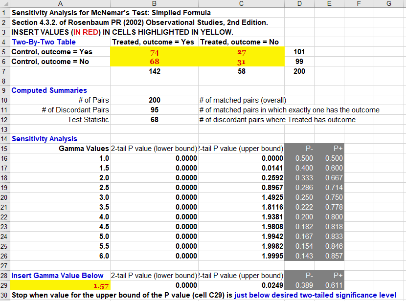

```{r, echo = FALSE}
library(knitr)
opts_chunk$set(comment = NA)
```

## Setup

```{r packages and data, message=FALSE, warning = FALSE}
library(knitr)
library(Matching)
library(rbounds)
library(janitor)
library(tidyverse)
```

# Sensitivity Analysis for Matched Samples

## The Role of Assumptions

Scenario | Analytic Goal | Role of Assumptions
---------------------: | ----------------------: | :----------:
Randomized Experiments | Testing H_0_: No effect | None
Randomized Experiments | Estimating effects, CIs | Minor
Observational Studies  | Anything at all         | **Massive**

- **All** observational studies are potentially affected by hidden bias.
    - Sensitivity analyses are needed in any such study.

## Stability Analyses

- Are our conclusions mere artifacts of analytic decisions, or are they stable over analyses that differ in (apparently) innocuous ways?
- Examine a series of discrete decisions, hoping conclusions mostly don't change if the decision is changed.

## Sensitivity Analyses

- How much do plausible changes in assumptions change conclusions?
- How much hidden bias would have to be present to alter the study's conclusions?

We want to assess the potential for **unmeasured** covariates to change our conclusions.

- To maximize trouble, the unmeasured covariate must be independent of the variables in our propensity model.
    - We missed a dimension of the problem, or our measure is terribly weak.
    - This is part of the motivation to be inclusive in building the PS model.

## Idealized Standards for a Sensitivity Evaluation

- Logic, Theory and Empirical Evidence
- "It is unlikely that a non-huge hidden bias would substantially change our conclusions"
    - Measured and incorporated every major known factor that we could identify.
    - Effects on health outcomes were generally large, consistent with earlier work and clinically plausible.

An omitted variable is most likely to change our conclusions about the exposure if it is

- closely related to the outcome,
- seriously imbalanced by exposure,
- uncorrelated with the propensity score.

## Does PS Matching Balance "Omitted" Covariates?

**No.**

- We fit^[Love et al 2003 abstract] a published PS model to data from the RHC study, using 82 covariates.
- Then we obtained data on 17 other covariates, not included in the PS model.

Corr. with PS | Covariates | Balance Improved | Median Bias Reduction
---------------: | ---------: | ----------------: | ----------------:
Sig. (*p* < .05) | 10 | 9 (90%) | 45%
Not Sig. | 7 | 2 (29%) | -36%

## Sensitivity Analysis Approach

- When describing possible hidden bias, we refer to characteristics we did not observe, and therefore did not control for in PS.
- If our study was randomized, or somehow free of hidden bias, we would have strong evidence of a treatment effect.
- To explain away the observed effect, an unobserved covariate would need to increase the odds of exposure to treatment and the odds of outcome by at least a factor of $\Gamma$.

## The Role of Sensitivity Analysis

>- Cameron and Pauling (1976, 1978) concluded Vitamin C increased survival time of colon cancer patients.
>- The result was not sensitive to an unmeasured binary covariate which led to a 10-fold increase in odds of exposure to vitamin C and was a perfect predictor of the outcome^[See Rosenbaum 2002, 2017].
>- Sensitivity analysis looks great, yet the findings were contradicted in a Mayo Clinic RCT.
>- Conclusion: Sensitivity analyses cannot indicate what biases are present, it can only indicate the magnitude needed to alter the conclusion.

# Surgery vs. Medicine for Coronary Artery Disease

## CAD: Surgery or Medicine

Coronary bypass surgery or medical/drug therapy for CAD^[See Rosenbaum and Rubin 1983, 1984]?

- 1,515 subjects
    - 590 surgical patients (39%), the rest medical
- PS included 74 observed covariates
    - Hemodynamic, Angiographic, Lab and Exercise Test Results
    - Patient histories, and demographics
- Stratified into PS quintiles, then combined estimates of Pr(sustained improvement at 6 mo).

## Surgery vs. Medicine Study: Results + Sensitivity

Substantial Improvement | Prob (SE)
-----------------------: | ----------------:
Medical | 0.359 (0.042)
Surgical | 0.669 (0.059)

Conclusion: Pr(improved | Surgery) > Pr(improved | medicine)

- A hypothetical unobserved binary covariate would have to **more than triple** the odds of surgery and **more than triple** the odds of improvement, before altering the conclusion^[See Rosenbaum and Rubin 1983, 1984].

## Goal of a Formal Sensitivity Analysis

To replace a general qualitative statement that applies in all observational studies...

> "The association we observe between treatment and outcome does not imply causation."

> "Hidden biases can explain observed associations."

with a quantitative statement that is specific to what is observed in a particular study

> "To explain the association seen in this particular study, one would need a hidden bias of this particular magnitude."


## Hidden Bias

- Two units (patients, subjects, whatever) with the same observed covariates have different chances of receiving the exposure.
- If the association is strong, the hidden bias needed to explain it would be large.  
- If a study is free of hidden bias (one example: RCT), this means that any two units that appear similar in terms of their observed covariates actually have the same chance of assignment to exposure.

How would inferences about treatment effects be altered by hidden biases of various magnitudes? 
- How large would these differences have to be to alter the qualitative conclusions of the study?

## The Design Sensitivity Parameter $\Gamma$

$\Gamma$ measures degree of departure from a study that is free of hidden bias.  A sensitivity analysis will consider possible values of $\Gamma$ and show how the inference might change.  

- $\Gamma$ describes the odds ratio comparing the odds of being selected for treatment for two units who are similar on all observed covariates.
    - If $\Gamma$ = 1, this means that the study is free of hidden bias 
        - Subjects with the same observed covariates have the same odds (hence same probability) of  exposure. 
    - If $\Gamma$ = 2, then two units who appear similar, who have the same set of observed covariates **X**, could differ in their odds of receiving the treatment by as much as a factor of 2, so that one could be twice as likely as the other to receive the exposure.

## Relating $\Gamma$ to Sensitivity Statements

A study is **sensitive** if values of $\Gamma$ close to 1 could lead to inferences that are very different from those obtained assuming the study is free of hidden bias.  

- A study is *insensitive* if extreme values of $\Gamma$ are required to alter the inference.

> "To attribute the (observed significant) outcome to an unobserved covariate rather than to the treatment, that unobserved covariate has to increase the odds of treatment by a factor of $\Gamma$, and also predict our outcome quite well."

# Using a Spreadsheet

## Getting the Message Across

Straightforward, Spreadsheet-Based Formal Sensitivity Analysis for Matched Samples

- Separate tabs for Outcomes: Binary, Continuous, Survival (w/censoring)
- All calculations based on base case formulas using sign-score tests as described in Rosenbaum 2002 [some nuances ignored (dealing with ties, etc.)]
- Available documents on [our Data and Code page](https://github.com/THOMASELOVE/2019-500/tree/master/data-and-code) describe three examples

## Demonstration: A Binary Outcome

- Exposure: Heavy Smoker vs. Non-Smoker
- Outcome: death due to lung cancer (no censoring)

Suppose we paired 1042 heavy smokers to 1042 nonsmokers on the basis of a series of baseline characteristics. Resulting data table on **the 1042 PAIRS** is (LCD = dies from lung cancer)...

-- | Heavy Smoker LCD | Heavy Smoker No LCD | Total
------------------ | ---- | ---- | ----
Nonsmoker LCD      | 175 | 54 | **229**
Nonsmoker No LCD   | 110 | 703 | **813**
Total | **285** | **757** | **1042**

## McNemar Test (if this was randomized)

```{r}
test1 <- matrix(c(175, 54, 110, 703), nrow = 2)
mcnemar.test(test1, correct = F)
```

This is an appropriate result if $\Gamma$ = 1, but how much hidden bias would need to be present to change this conclusion?

## How much hidden bias is needed?

- Pairs = 1042 matched pairs overall
- D = 164 discordant pairs (exactly one member had LCD)
- T = 110 discordant pairs in which Heavy Smoker had LCD

We find the binomial probability of obtaining a value of T = 110 or higher assuming a binomial distribution with D = 164 trials and common probability = *p^+^* and *p^-^* for the upper and lower bounds. PDF specifies the details.

## Spreadsheet Demonstration

```{r, echo = FALSE, fig.align = "center", out.width = '80%'}
knitr::include_graphics("figures/sens_demo_bin.png")
```

# Running Sensitivity Analyses 

## Idealized Standards for a Sensitivity Evaluation

- Logic, Theory and Empirical Evidence
- "It is unlikely that a non-huge hidden bias would substantially change our conclusions"
    - Measured and incorporated every major known factor that we could identify.
    - Effects on health outcomes were generally large, consistent with earlier work and clinically plausible.

An omitted variable is most likely to change our conclusions about the exposure if it is

- closely related to the outcome,
- seriously imbalanced by exposure,
- uncorrelated with the propensity score.

## The Design Sensitivity Parameter $\Gamma$

$\Gamma$ measures degree of departure from a study that is free of hidden bias.  A sensitivity analysis will consider possible values of $\Gamma$ and show how the inference might change.  

- $\Gamma$ describes the odds ratio comparing the odds of being selected for treatment for two units who are similar on all observed covariates.
    - If $\Gamma$ = 1, this means that the study is free of hidden bias 
        - Subjects with the same observed covariates have the same odds (hence same probability) of  exposure. 
    - If $\Gamma$ = 2, then two units who appear similar, who have the same set of observed covariates **X**, could differ in their odds of receiving the treatment by as much as a factor of 2, so that one could be twice as likely as the other to receive the exposure.

## Relating $\Gamma$ to Sensitivity Statements

A study is **sensitive** if values of $\Gamma$ close to 1 could lead to inferences that are very different from those obtained assuming the study is free of hidden bias.  

- A study is *insensitive* if extreme values of $\Gamma$ are required to alter the inference.

> "To attribute the (observed significant) outcome to an unobserved covariate rather than to the treatment, that unobserved covariate has to increase the odds of treatment by a factor of $\Gamma$, and also predict our outcome quite well."

# Estimating $\Gamma$ in a Simulated Situation

## A Simulated Data Set

```{r, message = FALSE}
sim_obs <- read_csv("data/sim_sens_2020.csv") %>% clean_names()
sim_obs
```

## `sim_obs` data

```{r, message = FALSE}
summary(sim_obs)
```

## Study A: A Binary Outcome

```{r}
sim_obs %>% tabyl(treatment, out_binary) %>% 
    adorn_totals() %>%
    adorn_percentages() %>%
    adorn_pct_formatting() %>%
    adorn_ns(position = "front")
```

## Binary Outcome (1:1 Match)

```{r}
set.seed(500)
m.obj <- Match(Y = sim_obs$out_binary, 
               Tr = as.logical(sim_obs$treatment), 
               X = sim_obs$propensity, 
               M = 1, replace = FALSE)
```

Why set a seed? Because if you don't, the match can change on you (tied propensity scores...)

---

```{r}
summary(m.obj)
```

## Estimating $\Gamma$ with `binarysens`

```{r}
binarysens(m.obj, Gamma = 2.5, GammaInc = 0.25)
```

## Making our $\Gamma$ Estimate more precise: `binarysens`

```{r}
binarysens(m.obj, Gamma = 1.75, GammaInc = 0.05)$bounds %>%
  tibble() %>% slice(11:17)
```

## Obtaining the Matched Sample

If we wanted to use the spreadsheet software to calculate $\Gamma$, we'd need the matched sample.

```{r}
matches <- factor(rep(m.obj$index.treated, 2))

sim.matchedsample1 <- 
  cbind(matches, 
        sim_obs[c(m.obj$index.control, 
                  m.obj$index.treated),]) %>%
  arrange(matches)
```

## The Matched Sample

```{r}
head(sim.matchedsample1)
```

## Building a 2x2 table from the Matched Sample

```{r}
tmp <- sim.matchedsample1 %>% 
  mutate(res = 10*treatment + out_binary) %>%
    group_by(matches) %>%
    summarize(out.treated = out_binary[2], 
              out.control = out_binary[1]) 
```

```{r}
tmp %>% tabyl(out.control, out.treated) %>% adorn_title()
```

## What would we put into the spreadsheet?

2x2 Table         | Treated has `out1` | Treated no `out1`
----------------: | ---------------: | --------------:
Control has `out1`  | `r (tmp %>% count(out.treated, out.control) %>% mutate(res = 1:4) %>% filter(res == 4) %>% select(n) -> a)` | `r (tmp %>% count(out.treated, out.control) %>% mutate(res = 1:4) %>% filter(res == 2) %>% select(n) -> c)`
Control no `out1`   | `r (tmp %>% count(out.treated, out.control) %>% mutate(res = 1:4) %>% filter(res == 3) %>% select(n) -> b)` | `r (tmp %>% count(out.treated, out.control) %>% mutate(res = 1:4) %>% filter(res == 1) %>% select(n) -> d)`

In our `r a + b + c + d` matched pairs, we have `r b + c` pairs in the off-diagonal. There are `r b` pairs where only the treated subject has the outcome. Assuming no hidden bias, we calculate an approximate 95% confidence interval for the McNemar odds ratio (which is 68/27 or `r round(68/27,2)`) with

```{r}
ci.p <- prop.test(x = 68, n = 68+27)$conf
ci.odds <- ci.p/(1 - ci.p)
ci.odds
```

## Sensitivity Spreadsheet (**2008**) Results?

```{r, echo = FALSE, fig.align = "center", out.width = '80%'}

```

## OK, so let's say $\Gamma$ is about 1.6. What next?

Assuming no hidden bias, the propensity-matched result describes a strong relationship (McNemar odds ratio = 2.52, with 95% CI (1.58, 4.03)) between treatment receipt and our binary outcome.

To attribute the higher rate of our binary outcome to an unobserved covariate rather than to the effect of our treatment, that unobserved covariate would need to produce more than a 60% increase (or a $\Gamma$ = 1.6-fold increase) in the odds of receiving the treatment, and be a very strong predictor of the binary outcome.

## Study B: A Quantitative Outcome

```{r}
set.seed(500)
m.obj2 <- Match(Y = sim_obs$out_quant, 
               Tr = as.logical(sim_obs$treatment), 
               X = sim_obs$propensity, 
               M = 1, replace = FALSE)
```

## Estimate from `Matching` of Treatment Effect

```{r}
summary(m.obj2)
```

## Using `psens` to estimate $\Gamma$

```{r}
psens(m.obj2, Gamma = 2.5, GammaInc = 0.25)
```

## Refining our $\Gamma$ estimate

```{r}
psens(m.obj2, Gamma = 2, GammaInc = 0.05)$bounds %>%
  tibble() %>% slice(13:18)
```

## Rosenbaum Bounds: Hodges-Lehmann Estimate

```{r}
hlsens(m.obj2, pr = 0.1, Gamma = 2.5, GammaInc = 0.25)
```

## Study C: Survival (Time to Event) Outcome

For the spreadsheet, we need to identify the number of pairs with a clear winner, and the number of those "clear winner" pairs where the winner is the "treatment = 1" subject. 

```{r}
match3 <- sim.matchedsample1 %>% tibble() %>%
  select(matches, treatment, censored, out_time, 
         subject, propensity) %>%
  arrange(matches, -treatment)

head(match3, 2)
```

## Determining "Clear Winners" (1)

**What if there is no censoring?**

```{r}
match3 %>% filter(matches %in% c(302, 308))
```

- Which subject in match 302 has the longer `out_time`?
- Which subject in match 308 has the longer `out_time`?
- Will we have a clear winner if neither subject's time is censored?

## Determining "Clear Winners" (2)

**What if both subjects in the pair are censored?**

```{r}
match3 %>% filter(matches == 310)
```

- Which subject in match 310 has the longer `out_time`?
- Will we have a clear winner if both subjects' time is censored?

## Determining "Clear Winners" (3)

**What if only the treated subject in the pair is censored?**

```{r}
match3 %>% filter(matches %in% c(301, 307))
```

- Which subject in match 301 has the longer `out_time`?
- Which subject in match 307 has the longer `out_time`?
- Will we have a clear winner if exactly one subject's time is censored?

## Determining "Clear Winners" (4)

**What if only the control subject in the pair is censored?**

```{r}
match3 %>% filter(matches %in% c(305, 337))
```

- Which subject in match 305 has the longer `out_time`?
- Which subject in match 337 has the longer `out_time`?
- How do we know if we will have a clear winner if exactly one subject's time is censored?

## Getting the Counts for the Spreadsheet

```
write_csv(match3, "data/match3.csv")
```

Across our 200 matches, I hand-counted the number of clear winners, and in each case, who wins. This is certainly an area where a more patient programmer could do the job faster.

- If both treated and control are censored, no clear winner (2 pairs)
- If both treated and control are NOT censored, clear winner (134 pairs) unless there is a tie (0 pairs)
    - In 73 of those 134 pairs, the treated subject had the longer `out_time`.
- If either treated or control is censored but not both, then there is a clear winner only if the censored subject had the longer `out_time`.
    - 10 pairs where treated subject clearly wins despite being censored.
    - 12 pairs where control subject clearly wins despite being censored.

So, in total, we have 134 + 10 + 12 = 156 pairs with a clear winner. In 83 of those, the treated subject had the longer `out_time`.

## Result from the Spreadsheet

```{r, echo = FALSE, fig.align = "center", out.width = '80%'}
knitr::include_graphics("figures/ss02.png")
```

## What if it had been 113 out of 156 instead?

```{r, echo = FALSE, fig.align = "center", out.width = '80%'}

```

## Summary: Sensitivity Analysis

Hidden bias is the great problem with observational studies, and with PS models.

- Sensitivity analysis after matching can be applied in many scenarios.
- We hope to find that an unobserved covariate would have to be very powerful to alter our conclusions.
- That doesn't mean that such a covariate (or set of them) doesn't exist.

## Our PS "Formula" for the Heart Failure papers

1. Identify available data related to selection for the exposure, and to risk for the outcome.
2. Demonstrate need for PS modeling (imbalance in key characteristics), and evaluate PS balance after matching, usually through standardized difference plots (usually significance, too, unfortunately.)
3. Model exposure effect (Cox models stratified by matched pair identifiers, typically.)
4. Formal sensitivity analysis **if** effect is significant.

# This is the end of the pre-recorded lecture for Class 7.

## In-class materials

- Augmenting Sensitivity Analyses (Rosenbaum Chapter 9)

## Augmenting a Sensitivity Analysis

Lots of things can be described as part of a sensitivity analysis. We are focusing on one issue: quantifying departures from randomized (i.e. ignorable) treatment assignment.

Ignorable treatment assignment means that if two people have the same values of the observed covariates (and thus, for example, the same propensity score) then they have the same probability of treatment.

- Rosenbaum's bounds on $\Gamma$ are just one possibility.

- $\Gamma$ and $\Theta_p$ and $\Lambda$ and $\Delta$ are just different methods of describing departure from ignorable treatment assignment in matched pairs, although only $\Gamma$ applies outside of matched pairs.

## $\Gamma$ and $\Theta_p$


We can express this in terms of $\Gamma$ or $\Theta_p$ pretty easily in the matched pairs setting.

$$
\frac{1}{1 + \Gamma} \leq \Theta_p \leq \frac{\Gamma}{1 + \Gamma}
$$

$\Gamma$ = 2 is the same magnitude of departure from ignorable treatment assignment as the interval from 0.33 to 0.67 for $\Theta_p$.

If $\Gamma$ = 2, then Harry might be twice as likely as Sally to receive the treatment (so Harry's probability $\Theta_H$ is 2/3 and Sally's is 1/3) or Sally might be twice as likely as Harry (so Harry's probability could be as low as 1/3) to receive the treatment.

## Amplifying the $\Gamma$ value with $\Lambda$ and $\Delta$

This approach, like $\Theta_p$ bounds, applies only in the case of matched pairs.

- $\Lambda$ tells you about the relationship of an unobserved covariate with treatment assignment.
- $\Delta$ tells you about the relationship of an unobserved covariate with the outcome.

$$
\Gamma = (\Lambda \Delta + 1) / (\Lambda + \Delta)
$$

## Table 9.1

```{r, echo = FALSE, fig.align = "center", out.width = '80%'}

```

## Using the Amplification

If $\Gamma = 1.5$ then, for example we could use 

- a bound on $\Theta_p$ from 0.40 to 0.60
- or a combination of $\Lambda = 2$ and $\Delta = 4$
- or a combination of $\Lambda = 4$ and $\Delta = 2$
- or a requirement that $\Lambda = 1.5$ and that the unobserved covariate be a perfect predictor of the outcome.
- or a requirement that $\Delta = 1.5$ and that the unobserved covariate be a perfect predictor of treatment assignment.